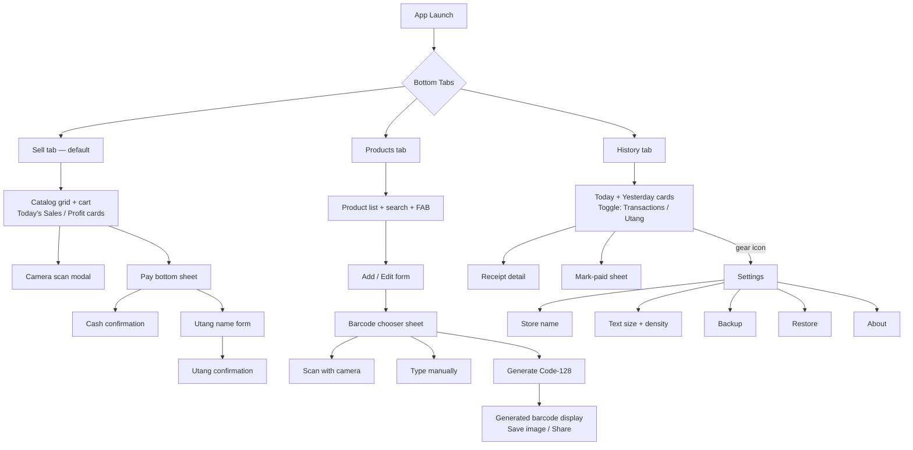
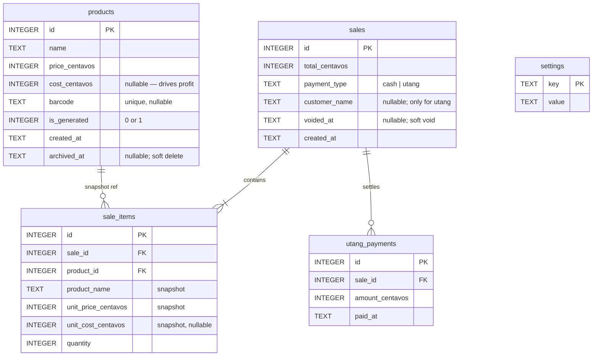
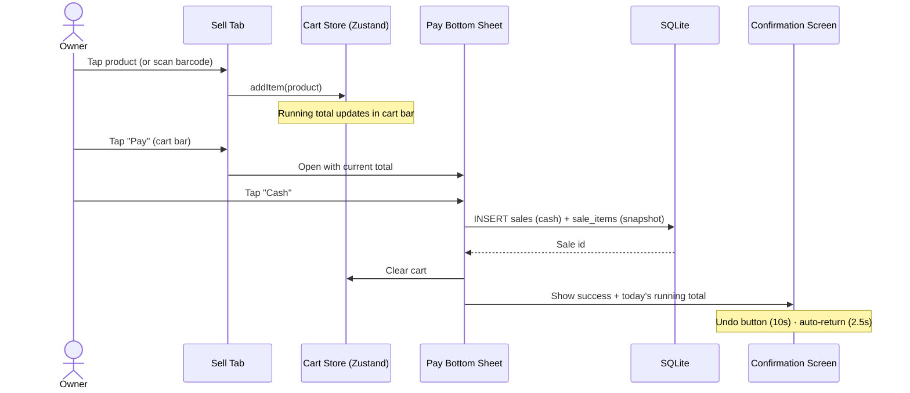
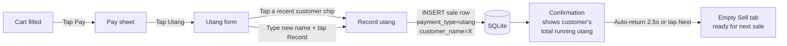
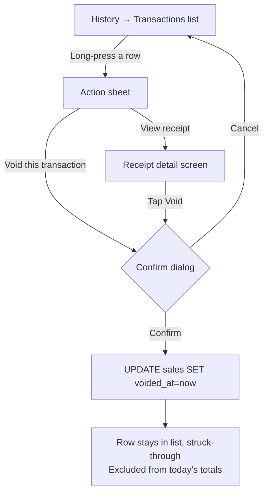
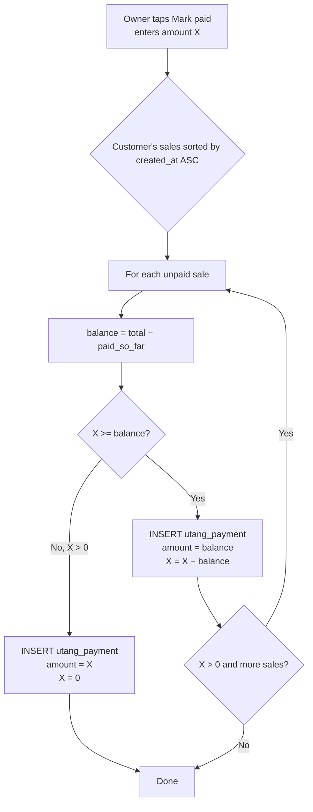
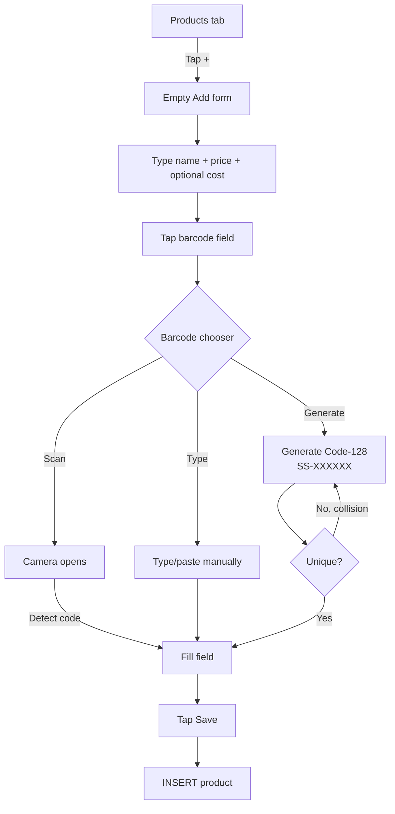
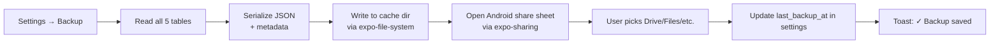
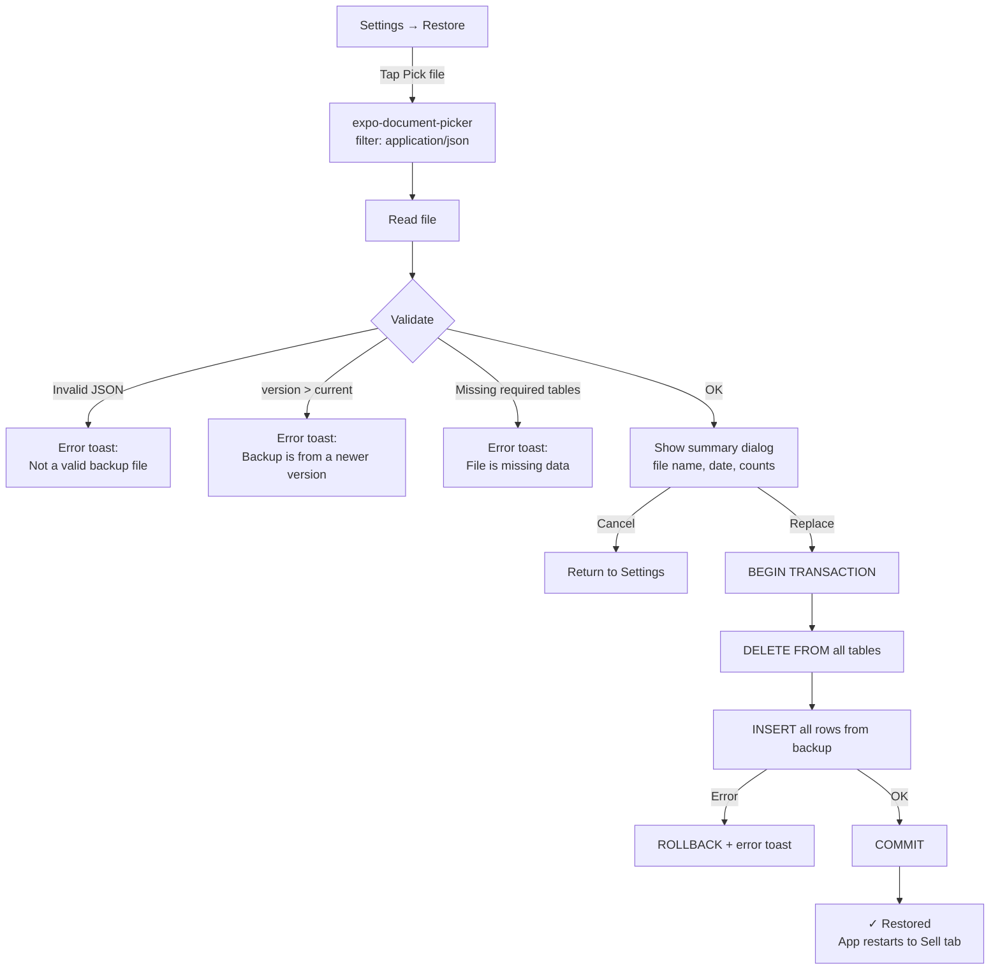

# Simple Sari-Sari Store POS — Design Spec

**Status:** Draft for review
**Date:** 2026-05-10
**Author:** Bryan (designed collaboratively)
**Target:** React Native Android app, optimized for phone and tablet

---

## 1. Overview

A point-of-sale app for a single sari-sari store owner. Built for **non-tech-savvy** users — primary user flows are designed to be possible in 2–3 taps. Optimized for both phone and tablet via an adaptive layout. Offline-first, with manual backup/restore for disaster recovery.

### 1.1 Goals

- Make recording a sale **fast** (cart → Pay → Cash → done in 3 taps for the common case).
- Make the app **legible at a glance** for older users (large text, high contrast, configurable size).
- Track **utang** (customer credit) cleanly so the owner stops losing money to forgotten balances.
- Surface **today's sales and profit** as the always-visible headline numbers.
- Support **barcode scanning** today (camera) and **physical scanner** later (HID, no code change).
- Support generating a printable **barcode** for products that don't have one.

### 1.2 Non-goals (v1)

- Multi-user / login / roles
- Inventory tracking (stock counts, restock history)
- Receipts / thermal printing
- Cloud sync, multi-device sync, or a backend server
- Sales analytics beyond today + yesterday + per-customer utang
- Categories / product photos
- Suppliers, purchase orders, cost-of-goods-sold accounting beyond a single optional cost field
- Discounts, taxes, or promotions
- Cigarette pack ↔ stick auto-conversion (each tingi item is its own product)

---

## 2. Tech stack

| Layer | Choice | Rationale |
|---|---|---|
| Framework | **Expo (managed) with dev client** | Easy build + dev loop. Dev client allows future native modules without ejecting. |
| UI library | **React Native Paper** | Material, polished, well-maintained. User declined Ant Design (RN port is less maintained). |
| Navigation | **React Navigation** (native stack + bottom tabs) | RN standard. |
| State | **Zustand** | Tiny, no boilerplate, sufficient for cart/settings. |
| DB | **expo-sqlite** + thin query helpers | Local persistence, no ORM overhead. |
| Camera/Barcode scan | **expo-camera** | Built-in barcode detection (Code 128, EAN, UPC, QR). |
| Barcode rendering | **`react-native-barcode-svg`** (built on react-native-svg) | Renders Code 128 / EAN / UPC barcodes as native SVG. |
| File I/O (backup) | **expo-file-system** + **expo-sharing** | Write JSON, share via Android share sheet. |
| Document picker (restore) | **expo-document-picker** | Read JSON file from anywhere on device. |
| Font | **Plus Jakarta Sans** via `@expo-google-fonts/plus-jakarta-sans` | Modern, slightly friendly, screen-optimized. Bundled in APK. |
| Layout breakpoint | `useWindowDimensions()` hook | Phone vs tablet split decision. |

**Total runtime dependencies: ~9.** Build target: signed Android APK via EAS Build.

---

## 3. Information architecture

Three bottom tabs. Every screen lives under one of them. **Settings** is reached from a gear icon in the History tab's top bar (not its own tab — it's used rarely).



**Screen count:** 3 tab roots + ~12 secondary screens/modals = **~15 screens total.**

---

## 4. Data model

Five SQLite tables. All money stored as **integer centavos** (₱12.50 = 1250). Times as ISO-8601 strings in device local time (we use the device's clock to define "today"). Soft delete/void rather than hard delete to preserve historical integrity.

### 4.1 ERD



### 4.2 SQL schema

```sql
CREATE TABLE products (
  id INTEGER PRIMARY KEY AUTOINCREMENT,
  name TEXT NOT NULL,
  price_centavos INTEGER NOT NULL CHECK (price_centavos >= 0),
  cost_centavos INTEGER NULL CHECK (cost_centavos IS NULL OR cost_centavos >= 0),
  barcode TEXT UNIQUE NULL,
  is_generated INTEGER NOT NULL DEFAULT 0 CHECK (is_generated IN (0, 1)),
  created_at TEXT NOT NULL,
  archived_at TEXT NULL
);
CREATE INDEX idx_products_name ON products(name);
CREATE INDEX idx_products_archived ON products(archived_at);

CREATE TABLE sales (
  id INTEGER PRIMARY KEY AUTOINCREMENT,
  total_centavos INTEGER NOT NULL CHECK (total_centavos >= 0),
  payment_type TEXT NOT NULL CHECK (payment_type IN ('cash', 'utang')),
  customer_name TEXT NULL,
  voided_at TEXT NULL,
  created_at TEXT NOT NULL
);
CREATE INDEX idx_sales_created ON sales(created_at);
CREATE INDEX idx_sales_voided ON sales(voided_at);
CREATE INDEX idx_sales_customer ON sales(customer_name);

CREATE TABLE sale_items (
  id INTEGER PRIMARY KEY AUTOINCREMENT,
  sale_id INTEGER NOT NULL REFERENCES sales(id) ON DELETE CASCADE,
  product_id INTEGER NOT NULL REFERENCES products(id) ON DELETE RESTRICT,
  product_name TEXT NOT NULL,                    -- snapshot
  unit_price_centavos INTEGER NOT NULL,           -- snapshot
  unit_cost_centavos INTEGER NULL,                -- snapshot
  quantity INTEGER NOT NULL CHECK (quantity > 0)
);
CREATE INDEX idx_sale_items_sale ON sale_items(sale_id);

CREATE TABLE utang_payments (
  id INTEGER PRIMARY KEY AUTOINCREMENT,
  sale_id INTEGER NOT NULL REFERENCES sales(id) ON DELETE CASCADE,
  amount_centavos INTEGER NOT NULL CHECK (amount_centavos > 0),
  paid_at TEXT NOT NULL
);
CREATE INDEX idx_utang_payments_sale ON utang_payments(sale_id);

CREATE TABLE settings (
  key TEXT PRIMARY KEY,
  value TEXT
);
```

### 4.3 Derived values

- **Today's Sales** = `SUM(sales.total_centavos) WHERE date(created_at) = date('now', 'localtime') AND voided_at IS NULL`
- **Today's Profit** = `SUM((unit_price_centavos - unit_cost_centavos) * quantity)` over today's non-voided `sale_items` where `unit_cost_centavos IS NOT NULL`. (Items without a recorded cost don't contribute.)
- **Customer's outstanding utang** = `sales.total_centavos − COALESCE(SUM(utang_payments.amount_centavos), 0)` for `customer_name = ?` and `voided_at IS NULL`, summed across that customer's sales.
- **Sale fully paid** when its outstanding balance ≤ 0.

### 4.4 Snapshot policy

`sale_items.product_name`, `unit_price_centavos`, and `unit_cost_centavos` are copied from the `products` row at sale time. Renaming/repricing a product **does not rewrite history**. Receipts and historical totals stay accurate.

### 4.5 Soft-delete policy

- `products.archived_at` set on delete; product hidden from catalog but referenced in past sales.
- `sales.voided_at` set on void; sale stays visible in History (struck through, faded) but excluded from totals.

---

## 5. Core flows

### 5.1 Sale flow (Cash path — 2 taps)



### 5.2 Sale flow (Utang path — 3-4 taps)



### 5.3 Void flow



### 5.4 Utang FIFO allocation (Mark paid)

When a customer pays — partially or fully — the payment is allocated **FIFO** across their unpaid sales: oldest sale gets settled first, then the next, and so on.



**All allocations happen inside one DB transaction.** If anything fails, the whole payment rolls back.

### 5.5 Add product + barcode flow



**Generated barcode format:** `SS-` + 6 random alphanumerics from `[A-Z0-9]` (e.g., `SS-A1B2C3`). Encoded as **Code 128**. Collision check against existing barcodes; regenerate on collision.

---

## 6. Adaptive layout

Phone and tablet share the same components but compose differently.

- **Breakpoint:** `useWindowDimensions().width >= 720` ⇒ tablet layout.
- **Phone (single column):** catalog grid → sticky cart bar at the bottom → bottom nav.
- **Tablet (split):** catalog pane on the left (~60% width) + cart pane on the right (~40%) showing line items + total + big Pay button → bottom nav across the full width.

### 6.1 Catalog density (configurable, see §8)

| Setting | Phone columns | Tablet columns |
|---|---|---|
| Compact | 3 | 4 |
| Comfortable (default) | 2 | 3 |
| Spacious | 2 (bigger tiles) | 3 (bigger tiles) |

### 6.2 Long product names — three layers

1. **Catalog tile:** `numberOfLines={2}` + ellipsize. A small `⋯` indicator in the corner of any truncated tile signals "more content here." All tiles maintain uniform size.
2. **Long-press preview:** press-and-hold any tile → modal centered dialog with the **full name in large text** + price. Release to dismiss. A normal tap still adds to cart.
3. **Cart line:** name on one ellipsized line; quantity on a second line below. Tapping a cart row expands to full name + qty edit.
4. **Search** matches anywhere in the name (case-insensitive `LIKE %x%`).

---

## 7. Theme & typography

### 7.1 Palette (light, senior-friendly grey/white)

| Token | Hex | Use |
|---|---|---|
| `text` | `#212121` | Primary text |
| `text2` | `#263238` | Headers |
| `text3` | `#616161` | Secondary text |
| `primary` | `#455A64` | Cart bar, primary buttons, active tab indicator |
| `accent` | `#607D8B` | Labels, caption text |
| `muted` | `#90A4AE` | Inactive tab labels |
| `border` | `#CFD8DC` | Strong dividers |
| `borderLight` | `#ECEFF1` | Card borders |
| `softBg` | `#ECEFF1` | Top bar |
| `surface` | `#FAFAFA` | Page background |
| `card` | `#FFFFFF` | Card background |
| `profit` | `#2E7D32` | Profit number accent |
| `utang` | `#E65100` | Utang amount accent |
| `danger` | `#C62828` | Destructive actions |

### 7.2 Typography (Plus Jakarta Sans)

| Role | Size | Weight | Notes |
|---|---|---|---|
| Display (today's sales) | 24 | 800 | letter-spacing −0.02em, tabular-nums |
| Total (cart) | 22 | 800 | tabular-nums |
| Title (top bar) | 18 | 700 | letter-spacing −0.01em |
| Price (catalog tile) | 18 | 800 | tabular-nums |
| Tile name | 14 | 600 | 2-line clamp |
| Body | 14 | 500 | |
| Caption (uppercase label) | 11 | 600 | letter-spacing 0.06em |

`fontVariant: ['tabular-nums']` is set globally on number-heavy components so columns line up.

### 7.3 Tap targets

All interactive elements ≥ 48dp on the smaller axis. Pay button, scan button, bottom nav, list rows all sized accordingly.

---

## 8. Configurable display

Two independent settings under **Settings → Display**:

| Setting | Options | Effect |
|---|---|---|
| **Text size** | Small · Medium (default) · Large · Extra Large | Multiplies all theme font sizes by 0.9× / 1× / 1.15× / 1.3× |
| **Catalog density** | Compact · Comfortable (default) · Spacious | Controls Sell-tab grid columns + tile padding |

Stored in `settings` key/value table. Defaults cannot be lost (fallback hard-coded). Segmented controls (not sliders) chosen for clarity.

---

## 9. Backup & restore

### 9.1 Backup file format

```json
{
  "version": 1,
  "exported_at": "2026-05-10T07:42:13+08:00",
  "store_name": "Aling Pinay's Store",
  "products":       [ /* full rows */ ],
  "sales":          [ /* full rows */ ],
  "sale_items":     [ /* full rows */ ],
  "utang_payments": [ /* full rows */ ],
  "settings":       [ /* full rows */ ]
}
```

- **Default filename:** `sari-YYYY-MM-DD.json` (e.g., `sari-2026-05-10.json`).
- **Save location:** controlled by Android share sheet (Drive, Messenger, Files, email).
- `version` field allows future schema migrations on restore.

### 9.2 Backup flow



### 9.3 Restore flow



The restore is **atomic**: wipe + re-insert happen inside one SQLite transaction. Any failure rolls back to pre-restore state.

### 9.4 Backup nudges

`settings.last_backup_at` displayed under the Backup menu item. If it's been more than **14 days**, the timestamp turns orange to nudge the owner.

---

## 10. Error states & edge cases

| Scenario | Behavior |
|---|---|
| **No products yet** (fresh install) | Sell tab shows an empty state: "Add your first product to start selling" with a button that jumps to Products → Add. |
| **No sales today** | History tab shows ₱0 with "No sales recorded today yet." |
| **No utang** | Utang segment shows "No outstanding utang. Nice!" |
| **Camera permission denied** | Barcode scan button still appears; tapping it shows the system permission prompt. If denied permanently, a message in the scan view: "Camera permission needed. Open settings →" with a deep link. |
| **Duplicate barcode** | Save fails with inline error: "This barcode is already used by [other product name]." |
| **Decimal price input** | Inputs accept numbers with up to 2 decimal places (`/^\d+(\.\d{0,2})?$/`). Internally converted to centavos. |
| **Disk write failure** (backup, sale insert) | Toast: "Couldn't save. Try again." Sale not recorded; cart preserved. |
| **DB corruption on launch** | Show a recovery screen: "Database can't be opened. Try restoring from a backup." with Restore button. |
| **Restore: corrupt file** | Validation rejects, toast explains. Current data untouched. |
| **Restore: newer schema version** | "This backup is from a newer version of the app. Update the app first." |
| **Long-press accidentally** | Long-press preview is non-destructive. Releasing without tapping anything just dismisses. |
| **Cart abandoned** (owner switches tabs) | Cart persists in Zustand store; returns intact when owner comes back to Sell. |
| **App killed mid-sale** (before tap Cash/Utang) | Cart was never written to DB → lost (acceptable for v1). |
| **App killed during sale insert** | SQLite write is atomic; either fully written or not at all. |
| **Voiding a fully-paid utang sale** | Allowed. Voided sale's payments stay in `utang_payments` (orphan but harmless — they reference a voided sale). Customer's outstanding balance recalculated excludes voided sales. |
| **Future date / clock skew** | We trust device clock for "today". No special handling — out of scope. |
| **Product with no cost** | Profit calc skips that line item. Today's Profit may underreport. UI shows nothing special unless owner notices. |

---

## 11. Testing approach

Aligned with "simple as possible." No E2E framework (Detox) for v1.

### 11.1 Unit tests (Jest + `@testing-library/react-native`)

- **Money utilities:** parse/format centavos ↔ ₱ display string. Round-trip tests.
- **Profit calculation:** mixed line items (some with cost, some without), voided sales excluded.
- **Utang FIFO allocation:** partial payment across multiple sales, exact full payment, overpayment (refused or capped — define behavior in implementation).
- **Backup serialization:** dump all tables → JSON → re-read → assert deep-equal.
- **Barcode generation:** uniqueness across many invocations, format validation, collision retry.
- **Catalog search:** case-insensitive match anywhere in name.

### 11.2 Component tests

- **Cart bar / cart pane:** add/remove items, total updates correctly, Pay button enabled iff cart non-empty.
- **Pay sheet:** Cash flow inserts a sale row; Utang flow requires a name; cancel preserves cart.
- **Long-press preview:** appears on press-and-hold, dismisses on release, normal tap still adds to cart.
- **Adaptive layout:** at width ≥ 720 renders split, < 720 renders single-column.
- **Display settings:** changing text size scales font sizes; changing density changes column count.

### 11.3 Integration tests (in-memory SQLite)

- **End-to-end sale:** add 2 products → add to cart → tap Cash → assert sales/sale_items rows + today's total updated.
- **End-to-end utang:** sale → utang ledger shows customer + amount → mark paid (partial) → balance updated → mark paid (full) → customer disappears from ledger.
- **Backup → wipe → restore:** content equal before and after.
- **Void:** sale recorded → voided → today's totals exclude it → still visible in History.

### 11.4 Coverage target

≥ 80% on utility modules and DB query functions. Component tests cover happy path + 1-2 edge cases each. Manual smoke testing on a phone and a tablet before any release.

---

## 12. Out of scope (v1) / future considerations

These are noted for future iterations, not v1 work:

- **Bluetooth / USB barcode scanner**: HID-mode scanners work without code changes (they "type" into the focused input). A dedicated hidden capture input on the Sell tab can later make this seamless.
- **Bluetooth thermal label printer**: for printing generated barcode stickers directly.
- **Bluetooth thermal receipt printer**: for printing customer receipts.
- **Inventory tracking**: stock counts, low-stock alerts.
- **Categories** for the catalog.
- **Product photos.**
- **Cloud sync / multi-device.**
- **Date-range reports** beyond today + yesterday.
- **Per-product sales analytics** (best sellers, etc.).
- **Multi-store / multi-user.**
- **Tingi auto-conversion** (1 pack ↔ 20 pieces).

---

## Appendix A — Module layout (proposed)

```
src/
  App.tsx                        # Navigation root, theme provider, fonts
  theme/
    palette.ts                   # color tokens
    typography.ts                # type scale + tabular-nums
    paperTheme.ts                # Paper theme override
    useScaledTheme.ts            # applies text-size multiplier
  navigation/
    BottomTabs.tsx
    SellStack.tsx
    ProductsStack.tsx
    HistoryStack.tsx
  db/
    schema.sql                   # CREATE TABLE statements
    client.ts                    # expo-sqlite singleton
    migrations.ts                # version → migration[] map
    queries/
      products.ts
      sales.ts
      utang.ts
      settings.ts
  store/
    cart.ts                      # Zustand store
    settings.ts                  # Zustand store
  utils/
    money.ts                     # centavos ↔ peso formatting
    profit.ts                    # profit calculations
    fifo.ts                      # utang FIFO allocator
    barcode.ts                   # generation + validation
    backup.ts                    # serialize/deserialize/restore
    date.ts                      # today bounds, formatting
    layout.ts                    # useIsTablet, density resolver
  screens/
    sell/
      SellScreen.tsx
      CatalogGrid.tsx
      ProductTile.tsx
      LongPressPreview.tsx
      CartBar.tsx                # phone
      CartPane.tsx               # tablet
      PaySheet.tsx
      UtangForm.tsx
      ConfirmationScreen.tsx
    products/
      ProductListScreen.tsx
      ProductFormScreen.tsx
      BarcodeChooserSheet.tsx
      BarcodeScanScreen.tsx
      GeneratedBarcodeScreen.tsx
    history/
      HistoryScreen.tsx
      TransactionRow.tsx
      ReceiptDetailScreen.tsx
      VoidConfirmDialog.tsx
      UtangLedger.tsx
      MarkPaidSheet.tsx
    settings/
      SettingsScreen.tsx
      DisplaySettingsScreen.tsx
      BackupScreen.tsx
      RestoreScreen.tsx
  __tests__/
    utils/
    queries/
    integration/
```

---

## Appendix B — Open questions / things to confirm during implementation

1. Should the **Undo** button on the confirmation screen actually delete the sale row, or set `voided_at` (consistent with normal void)? Recommendation: hard delete since it's within ~10 seconds and never visible to the user. Keeps history clean.
2. Should overpayment on utang be **refused** (cap at owed balance) or **allowed** (creating a credit)? Recommendation: cap (refuse) — credits add complexity not in scope.
3. Should the Sell tab show **just-sold confirmation inline** (e.g., a non-blocking toast above the cart bar) instead of a full-screen confirmation? Current design uses full screen; could revisit if it feels disruptive in real use.
4. Should the **History date filter** (view older than today/yesterday) ship in v1, or be deferred? Currently deferred — easy add later.

End of spec.
